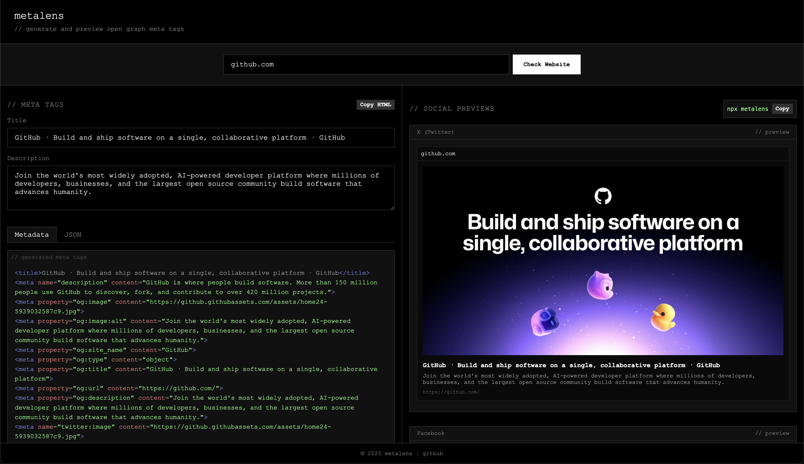

# ogpreview

> Extract, view, and analyze website metadata from the command line

## Features

- Extract Open Graph, Twitter card, and standard meta tags
- View metadata in a formatted terminal output
- Save metadata as JSON for further analysis
- Preview metadata in a local web interface



## Installation

```bash
npm install -g ogpreview

npx ogpreview
```

## Usage

```bash
# Provide URL directly
ogpreview example.com

# Interactive mode
ogpreview
```

After fetching metadata, choose to:

- View data in the terminal
- Save as JSON file
- Launch local preview in browser

## Development

```bash
git clone https://github.com/rudrodip/ogpreview.git
cd ogpreview
bun install
bun run dev
```

## License

MIT
